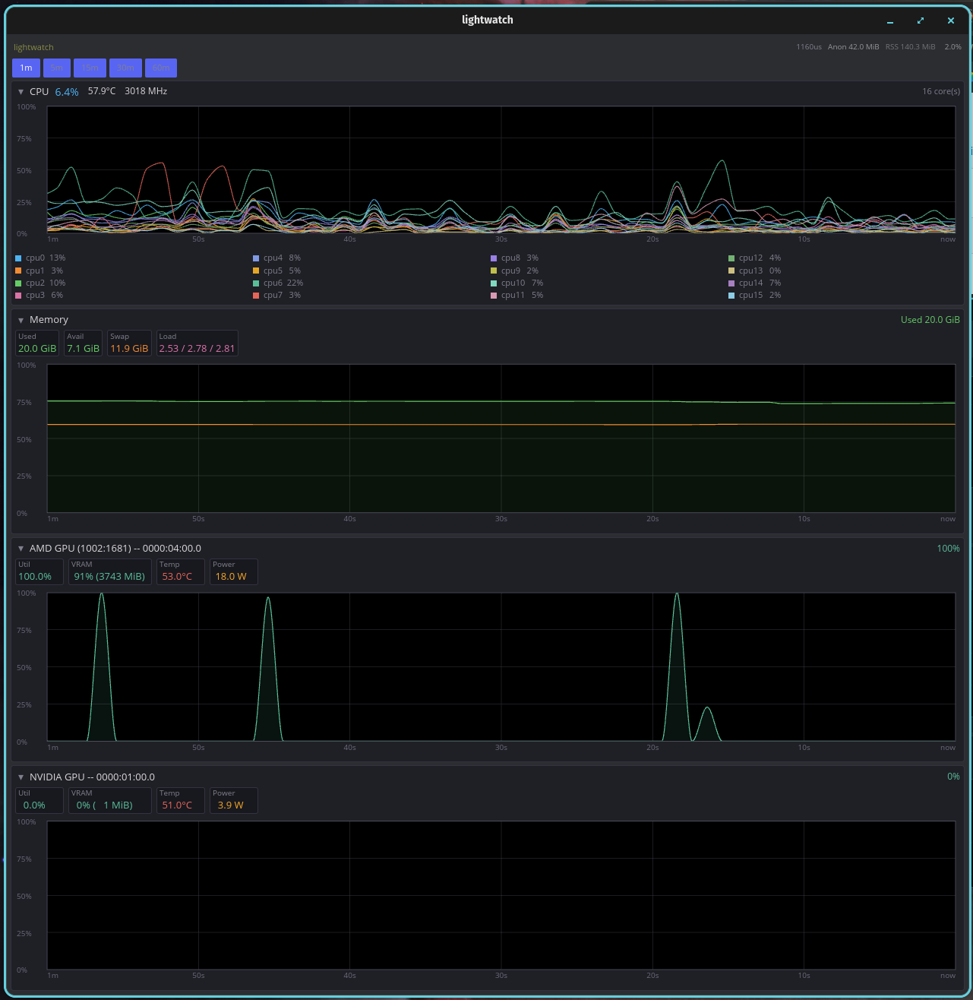

# lightwatch

A Linux system monitor built for leaving open. I like to keep my system monitor open continuously but the one that came with my distro had an occasional memory leak so I figured this was a good excuse to learn [Iced](https://iced.rs).

Lightwatch's warm default settles under 30 MiB of resident private memory on my machine, versus roughly 80–100 MiB—and often more—for GNOME System Monitor.

Rust + [iced](https://iced.rs). Linux only. MIT.



## Quick start

```bash
cargo build --release
cargo run --release              # GUI
cargo run --release -- --once    # one snapshot (waits ~1s for CPU deltas)
cargo run --release -- --soak 30 # headless RSS/CPU soak
```

| Flag | Default | Meaning |
|------|---------|---------|
| `--once` | | Snapshot to stdout, then exit |
| `--soak SECS` | | Headless sample loop + summary |
| `--interval MS` | `1000` | Sample period (100 ms–60 s) |
| `--history SECS` | `60` | Graph window (≤ 2 h; capacity = window ÷ interval + 6 edge samples) |
| `-h`, `--help` | | Flag summary, then exit |
| `-V`, `--version` | | Version, then exit |

Needs a recent stable Rust. GUI wants Wayland or X11. NVIDIA metrics need `libnvidia-ml` (driver package); without it, other panels still work.

## GPU power posture (iGPU default)

Lightwatch keeps its iced/wgpu compositor on the integrated AMD GPU by default. When `WGPU_POWER_PREF`, `VK_ICD_FILENAMES`, and `WGPU_BACKEND` are all absent and the Radeon ICD exists, startup sets `low`, the Radeon ICD path, and `vulkan` as one bundle. This avoids loading the unused GL renderer path. If the Radeon ICD is missing, only the soft `low` preference is set.

Setting **any one** of those three variables disables the whole automatic bundle; Lightwatch never mixes its defaults with user GPU configuration. To recover through GL, explicitly own the backend and power preference while clearing a stale ICD filter:

```bash
env -u VK_ICD_FILENAMES WGPU_BACKEND=gl WGPU_POWER_PREF=low cargo run --release
```

That recovery path may enumerate or wake a discrete GPU. Renderer DRM descriptors and NVIDIA NVML telemetry descriptors are separate: `/dev/nvidia*` may be open when an already-active dGPU is sampled without meaning the UI renders there. NVML is gated by sysfs `runtime_status`; Lightwatch never writes GPU power controls.

Separately, Lightwatch defaults iced's Tokio runtime to one worker. Set `TOKIO_WORKER_THREADS` before launch to choose another size.

## What it shows

- **CPU** — overall %, temp, freq in header; **all logical CPUs** as multi-series overlay chart with stable per-core colors and legend (live % per core). Up to 256 cores supported; palette wraps at 16 colors.
- **Memory / swap** — dual-series chart (used %, swap %) with grid; stat chips for Used, Avail, Swap, Load 1/5/15
- **GPUs** — discovered by **PCI address**, not DRM card index  
  - AMD: sysfs (`gpu_busy_percent`, VRAM, hwmon)  
  - NVIDIA: NVML only when sysfs `runtime_status` is **`active`** (fail-closed; will not wake a suspended dGPU)
- **Self** — private anonymous footprint (RssAnon), total RSS, self CPU%, last sample duration, overruns, skipped ticks. Private footprint answers "what does lightwatch itself own?" while total RSS explains system-monitor differences and GPU mappings.
- **Layout** — expanded chart panels share the window height equally; scroll only when the window is too short for useful minimums.
- **Section disclosure** — GSM-style **▾ / ▸** next to each section title collapses/expands the body (header stays with live summary). State is UI-only (sampling continues) and persists in `$XDG_CONFIG_HOME/lightwatch/ui.conf` (or `~/.config/lightwatch/ui.conf`).

**Not in MVP:** process table/kill, network, disk I/O, alerts, plugins, remote, daemons, root-only metrics.

## Architecture (agents + humans)

```
UI (iced)  ←── notify + pull latest Arc ──  Sampler thread
                                              │
                         collectors (I/O) → pure parsers → Snapshot
                         history rings live only in the sampler
```

| Idea | Rule |
|------|------|
| Snapshots | Immutable; built each tick |
| History | Fixed-capacity rings; `capacity = floor(window/interval) + 6` ≤ **7206** points/series. The guard supports three off-left and two off-right spline neighbors plus inclusive boundary accounting. |
| Charts | Two-interval diagnostic look-ahead for every chart. Dense CPU history uses absolute time buckets plus raw edge bands; the outer two logical pixels remain stable through arrivals and evictions. Gaps remain discontinuities. |
| Handoff | Single-slot latest value; **never** a queue of snapshots |
| Time | `SamplePoint { t_boot_ns, value: Option<f32> }` via `CLOCK_BOOTTIME` (suspend-aware gaps) |
| Scheduler | Deadline ticks; late → skip, no catch-up burst |
| GPU id | Full PCI BDF `domain:bus:slot.function` |
| NVIDIA | Power gate before **any** NVML init/handle/query |
| Memory | `used = MemTotal.saturating_sub(MemAvailable)` |
| CPU % | `/proc/stat` deltas; no guest double-count; counter decrease → rebaseline |

```
src/
  model/     Snapshot, Reading, HistoryConfig, Ring, SamplePoint
  parse/     /proc/stat, meminfo, loadavg, self/stat, self/status  (pure, tested)
  collect/   cpu, mem, self, gpu/{amd,nvidia}
  sample/    worker (deadline + rings), latest (single slot)
  ui/        iced view, prefs, sparklines
  diag.rs    --once / --soak
```

Layout is TEA-shaped (immutable model, messages, subscription). Collectors stay UI-agnostic. Section visibility is pure UI state over the same live history.

## Performance

The design keeps work and storage bounded: one sampler thread, one Tokio worker by default, a single-slot snapshot handoff, fixed-capacity history, no steady-state subprocesses, and a 100 ms display wake independent of the 1 Hz sampler.

Measured on Pop!_OS 24.04 COSMIC Wayland, Ryzen 7 6800HS, AMD 680M + RTX 3050 Mobile, using the optimized GUI after its 66-sample history filled. Swap is the value during this measurement window, not a promise that the kernel will never page out cold memory:

| Resident private (`RssAnon`) | Total RSS | Threads | Swap | CPU |
|------------------------------|-----------|---------|------|-----|
| 28.7 MiB | 88.8 MiB | 7 | 0 | 0.68% of one logical CPU |

`RssAnon` is resident anonymous memory owned by the process; `RssAnon + VmSwap` is the better leak signal once the kernel starts paging out cold memory. Total RSS also includes shared/file-backed mappings, which is why system monitors can show a much larger resident number. The renderer descriptors mapped to AMD PCI `0000:04:00.0`; NVIDIA descriptors belonged to telemetry for the already-active dGPU.

The private footprint also stayed around 29.5–30.3 MiB with zero swap during a separate 50-minute candidate run. Headless `--once` / `--soak` remains about 0.9 MiB anonymous and 6.5 MiB total RSS on this machine.

During later compiler pressure, the kernel moved 25.9 MiB of the same process's cold private pages to swap while resident private memory fell to 4.2 MiB; `RssAnon + VmSwap` remained about 30.1 MiB. Swap by itself is therefore not a leak signal—watch whether the combined private footprint keeps growing.

A paired GNOME System Monitor process-details capture after that reclamation showed:

| Displayed metric | Lightwatch | GNOME System Monitor | Lightwatch share |
|------------------|------------|----------------------|------------------|
| Memory | 4.2 MiB | 78.9 MiB | 5.3% |
| Resident Memory | 63.1 MiB | 211.8 MiB | 29.8% |
| Shared Memory | 58.9 MiB | 132.9 MiB | 44.3% |
| Virtual Memory | 764.3 MiB | 2.5 GiB | ~29.9% |
| CPU at capture | 0.13% | 0.80% | 16.3% |

In both windows, GNOME's displayed `Memory` is exactly `Resident Memory − Shared Memory`. It therefore excludes Lightwatch's swapped pages: the 4.2 MiB display is a resident number, while the contemporaneous `RssAnon + VmSwap` value was 30.1 MiB. Even that combined Lightwatch value was only about 38% of GNOME System Monitor's resident-private figure. Virtual memory is reserved address space rather than physical RAM, and the CPU row is an instantaneous reading; the 60-second 0.68% measurement above is the steadier Lightwatch result.

Release-mode geometry stress tests cover 256 series × 7,200 points. Ordinary gap-free history is pixel-bounded; the ring capacity remains the hard bound for fragmented input. The 256-series bursty case completes in roughly 22 ms on this machine.

## Why numbers differ from GNOME System Monitor

- **Process memory** — GNOME's process-details `Memory` is resident minus shared in these captures. It excludes swapped-out private pages; use `RssAnon + VmSwap` when looking for growth over time.
- **Memory “used”** — we use `MemTotal − MemAvailable`. GNOME often reports a different used/cache split; totals and “pressure” semantics won’t match line-for-line.
- **CPU** — overall % is from the aggregate `cpu` line; GNOME’s multi-core view weights cores visually. Sampling phase and window also differ.
- **VRAM / GPU** — different sources (sysfs vs NVML vs GNOME’s path) and units.

Treat lightwatch as its own instrument, calibrated for leave-it-open cost, not pixel-identical to GNOME.

## Develop

```bash
cargo fmt
cargo test
cargo clippy --all-targets --all-features -- -D warnings
cargo build --release
```

Local plans for agent workflows live under `plans/` (gitignored). Do not add speculative docs trees; keep this README the single source of product/architecture/performance truth.

## License

MIT — see [LICENSE](LICENSE).
