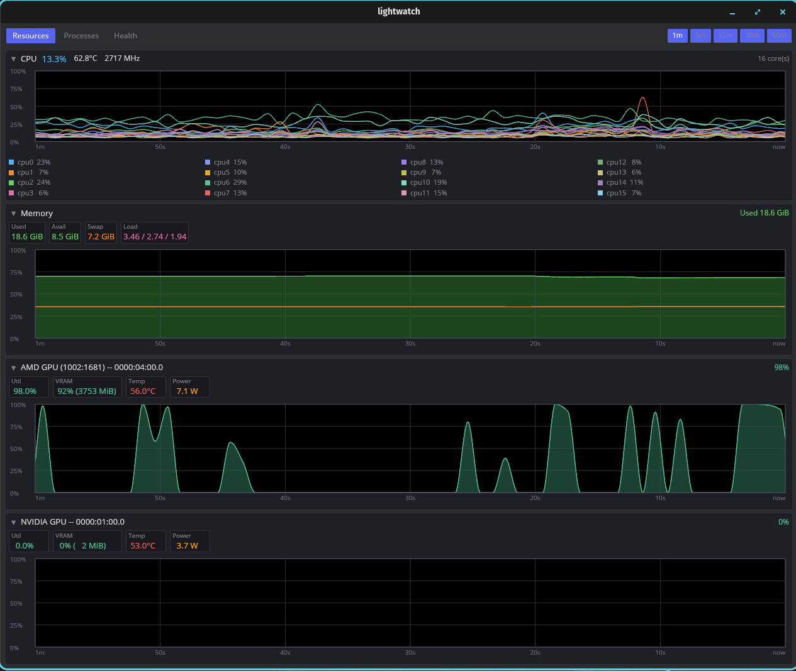

# lightwatch

A Linux system monitor built for leaving open. I like to keep my system monitor open continuously but the one that came with my distro had an occasional memory leak so I figured this was a good excuse to learn [Iced](https://iced.rs).

Lightwatch's warm default settles under 30 MiB of resident private memory on my machine, versus roughly 80–100 MiB for GNOME System Monitor.

Rust + [iced](https://iced.rs). Linux only. MIT.



## Quick start

```bash
cargo build --release
cargo run --release              # GUI
cargo run --release -- --once    # one snapshot (waits ~1s for CPU deltas)
cargo run --release -- --soak 30 # headless RSS/CPU soak

# Install/update the binary used by a desktop/tray launcher:
cargo install --path . --force   # → ~/.cargo/bin/lightwatch
```

| Flag | Default | Meaning |
|------|---------|---------|
| `--once` | | Snapshot to stdout, then exit |
| `--soak SECS` | | Headless sample loop + summary |
| `--interval MS` | `1000` | Sample period (100 ms–60 s) |
| `--history SECS` | `60` | Graph window (≤ 2 h; capacity = window ÷ interval + 6 edge samples) |
| `-h`, `--help` | | Flag summary, then exit |
| `-V`, `--version` | | Version, then exit |

Needs a recent stable Rust. GUI wants Wayland or X11. NVIDIA metrics need `libnvidia-ml` (driver package); without it, other panels still work.

## GPU power posture (iGPU default)

By default lightwatch pins the iced/wgpu compositor to the integrated AMD GPU: when `WGPU_POWER_PREF`, `VK_ICD_FILENAMES`, and `WGPU_BACKEND` are all unset and the Radeon ICD exists, startup sets `low` + Radeon ICD + `vulkan` as one bundle (avoids the unused GL path). If the ICD is missing, only the soft `low` preference is set. Setting **any** of those three vars disables the whole automatic bundle.

```bash
# Recover through GL while clearing a stale ICD filter:
env -u VK_ICD_FILENAMES WGPU_BACKEND=gl WGPU_POWER_PREF=low cargo run --release
```

NVML telemetry is orthogonal and fail-closed on sysfs `runtime_status` (never wakes a suspended dGPU). Tokio defaults to one worker; override with `TOKIO_WORKER_THREADS`.

## What it shows

Tabs: **Resources** (default) · **Processes** · **Health** (placeholder).

- **CPU** — overall %, temp, freq; multi-series per-core overlay (up to 256 cores; 16-color palette wraps)
- **Memory / swap** — used/swap charts; Used, Avail, Swap, Load 1/5/15 chips (`used = MemTotal − MemAvailable`)
- **GPUs** — by PCI BDF; AMD via sysfs; NVIDIA via NVML only when `runtime_status` is **active**
- **Processes** — full userspace list (sort Memory ↓ by default). Name (exe basename + Electron `(type)`), % CPU as share of **total** machine capacity, Memory as **RssAnon**, disk read/write totals, ID. Search by name or pid prefix. **End Process** = SIGTERM after `pid+starttime` check; Chromium helpers walk to the app root first
- **Layout** — expanded Resource panels share height equally; GSM-style **▾ / ▸** disclosure; prefs in `$XDG_CONFIG_HOME/lightwatch/ui.conf` (or `~/.config/lightwatch/ui.conf`)

**Not in MVP:** network, disk I/O dashboards, alerts, plugins, remote, daemons, process tree, SIGKILL escalate.

## Architecture

```
UI (iced)  ←── notify + pull latest Arc ──  Sampler thread
                                              │
                         collectors (I/O) → pure parsers → Snapshot
                         history rings live only in the sampler
```

| Idea | Rule |
|------|------|
| Snapshots | Immutable each tick; process rows latest-only (no rings) |
| History | Fixed rings; `capacity = floor(window/interval) + 6` ≤ **7206** |
| Charts | Two-interval look-ahead; pixel-stable edges; gaps stay gaps |
| Handoff | Single-slot latest; never a queue |
| Time | `CLOCK_BOOTTIME` sample stamps |
| Scheduler | Deadline ticks; late → skip |
| Process CPU | utime+stime ÷ wall ÷ online CPUs × 100 |
| Process mem | `RssAnon`; names from exe/argv0 basename |

```
src/
  model/     Snapshot, History, ProcessRow, name helpers
  parse/     /proc parsers (pure, tested)
  collect/   cpu, mem, self, proc, gpu/{amd,nvidia}
  sample/    worker + latest
  ui/        tabs, prefs, sparklines
  diag.rs    --once / --soak
```

TEA UI; collectors stay UI-agnostic.

## Performance

Bounded by design: one sampler thread, one Tokio worker by default, single-slot handoff, fixed history, 100 ms display tick vs 1 Hz sample.

Measured on Pop!_OS 24.04 COSMIC Wayland, **Ryzen 9 6900HS**, AMD 680M + RTX 3050 Mobile, release GUI after history warm-up:

| Resident private (`RssAnon`) | Total RSS | Threads | Swap | CPU |
|------------------------------|-----------|---------|------|-----|
| 28.7 MiB | 88.8 MiB | 7 | 0 | 0.68% of one logical CPU |

`RssAnon` is private footprint; total RSS includes shared/file maps (and GPU mappings). For leak watching under swap, use **`RssAnon + VmSwap`** — a long run held ~29.5–30.3 MiB private with zero swap; under compiler pressure resident Anon fell to 4.2 MiB while Anon+Swap stayed ~30.1 MiB. Headless `--once` / `--soak` is about 0.9 MiB Anon / 6.5 MiB RSS here.

Paired GSM process-details after that reclamation: Lightwatch “Memory” 4.2 MiB vs GSM 78.9 MiB (GSM’s column was Resident − Shared and excluded swapped pages). Treat instruments as calibrated differently, not pixel-identical.

Geometry stress: 256 series × 7,200 points; bursty case ~22 ms on this machine.

## Why numbers differ from GNOME System Monitor

- **Process memory** — Lightwatch uses `RssAnon`; GSM’s column is often closer to resident − shared.
- **Process CPU %** — both aim at total machine share; sampling windows still differ.
- **System “used” RAM** — we use `MemTotal − MemAvailable`.
- **GPU / VRAM** — different sources (sysfs, NVML, GNOME’s path).

## Develop

```bash
cargo fmt
cargo test
cargo clippy --all-targets --all-features -- -D warnings
cargo build --release
```

Local agent plans live under `plans/` (gitignored). This README is the product/architecture/performance source of truth.

## License

MIT — see [LICENSE](LICENSE).
